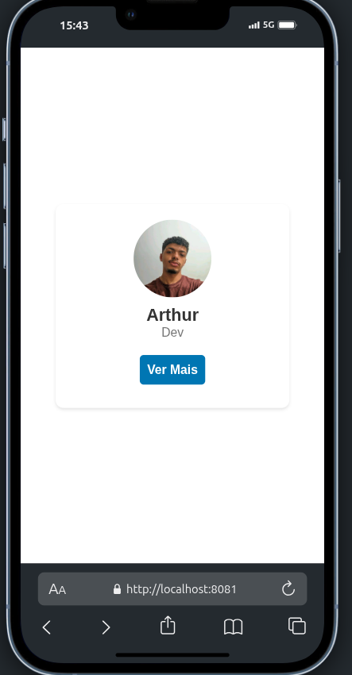

# Desenvolvimento Mobile com React Native

Este repositório contém os projetos desenvolvidos durante a disciplina de Dispositivos Móveis, focada no aprendizado de React Native para desenvolvimento de aplicações móveis multiplataforma.

## 📱 Estrutura do Repositório

O repositório está organizado em três partes principais: 
[Aula01](/aula01/) 
[Aula02](/aula02/) 
[Projeto](/projeto/)

## 🚀 Projetos

### Aula 01 - Fundamentos do React Native
Primeiro contato com o framework React Native, explorando conceitos básicos:
* **Componentes funcionais**
* **Props e passagem de parâmetros**
* **Estado com Hooks (useState)**
* **Renderização condicional**
* **Listas e renderização de dados**

**Exemplos incluem:**
* Componente simples com props
* Contador com botões de incremento/decremento
* Input de texto com atualização em tempo real
* Renderização de listas de itens

### Aula 02 - Componentes Avançados e Estilização
Aprofundamento no uso de componentes e estilização:
* **StyleSheet e estilos avançados**
* **Componentes de UI complexos**
* **Layouts responsivos**
* **Integração com recursos do dispositivo**
* **Eventos de interação com o usuário**

**Componentes principais:**
* **CartãoPerfil** - Card com informações de perfil e toggle para detalhes
* **CartaoApresentacao** - Card de apresentação com links para redes sociais
* **LayoutResponsivo** - Exemplo de layout flexível e adaptativo

### Projeto - CRUD de Cursos com Firebase
Aplicação completa integrando todos os conhecimentos e adicionando Firebase:
* **Autenticação de usuários**
* **Navegação com React Navigation**
* **CRUD completo (Create, Read, Update, Delete)**
* **Integração com Firestore Database**
* **Formulários e validação**
* **Navegação por tabs e stack**

**Recursos principais:**
* Tela de login com múltiplas opções de autenticação
* Listagem de cursos com carregamento dinâmico do Firebase
* Tela de detalhes e edição de cursos
* Perfil de usuário

## 🛠️ Tecnologias Utilizadas

* **React Native:** Framework de desenvolvimento mobile multiplataforma
* **Expo:** Plataforma para simplificação do desenvolvimento React Native
* **Firebase:** Plataforma de desenvolvimento de aplicativos
* **Firestore:** Banco de dados NoSQL
* **React Navigation:** Biblioteca para navegação entre telas
* **Hooks:** useState, useEffect, useCallback

## 📋 Pré-requisitos

* Node.js >= 23.x
* NPM ou Yarn
* Expo CLI
* Android Studio ou Xcode (para emuladores)

## ⚙️ Instalação e Execução

Para cada projeto, siga os mesmos passos:

1. Clone o repositório
2. Entre na pasta do projeto desejado
3. Execute `npm install` ou `yarn install`
4. Execute `npm start` ou `yarn start`

 
## Prints

### Projeto - Aula01

### Projeto - Aula02
